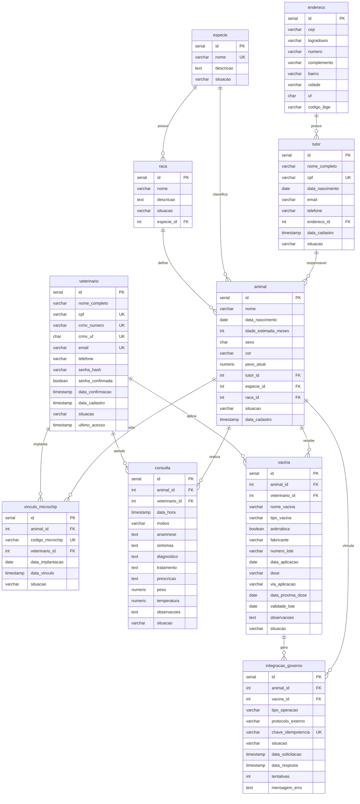
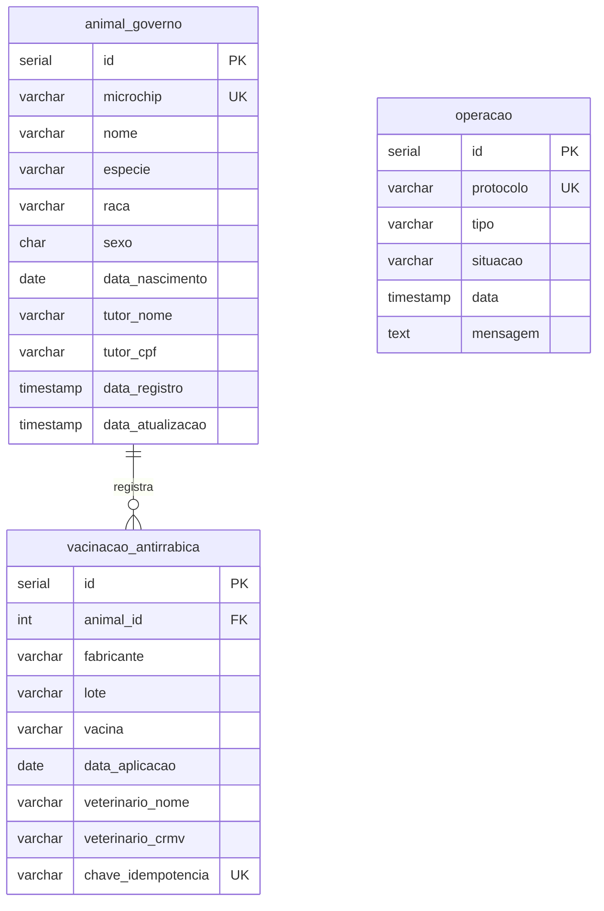

# Diagrama Entidade-Relacionamento (Mermaid) — SDM

## 1. Banco da Clínica (`clinica_db` — Porta 5432)

```mermaid
erDiagram
    endereco ||--o{ tutor : possui
    tutor ||--o{ animal : responsavel
    especie ||--o{ raca : possui
    especie ||--o{ animal : classifica
    raca ||--o{ animal : define
    animal ||--o{ vinculo_microchip : recebe
    veterinario ||--o{ vinculo_microchip : implanta
    animal ||--o{ consulta : realiza
    veterinario ||--o{ consulta : atende
    animal ||--o{ vacina : recebe
    veterinario ||--o{ vacina : aplica
    animal ||--o{ integracao_governo : vincula
    vacina ||--o{ integracao_governo : gera

    endereco {
        serial id PK
        varchar cep
        varchar logradouro
        varchar numero
        varchar complemento
        varchar bairro
        varchar cidade
        char uf
        varchar codigo_ibge
    }

    tutor {
        serial id PK
        varchar nome_completo
        varchar cpf UK
        date data_nascimento
        varchar email
        varchar telefone
        int endereco_id FK
        timestamp data_cadastro
        varchar situacao
    }

    especie {
        serial id PK
        varchar nome UK
        text descricao
        varchar situacao
    }

    raca {
        serial id PK
        varchar nome
        text descricao
        varchar situacao
        int especie_id FK
    }

    veterinario {
        serial id PK
        varchar nome_completo
        varchar cpf UK
        varchar crmv_numero UK
        char crmv_uf UK
        varchar email UK
        varchar telefone
        varchar senha_hash
        boolean senha_confirmada
        timestamp data_confirmacao
        timestamp data_cadastro
        varchar situacao
        timestamp ultimo_acesso
    }

    animal {
        serial id PK
        varchar nome
        date data_nascimento
        int idade_estimada_meses
        char sexo
        varchar cor
        numeric peso_atual
        int tutor_id FK
        int especie_id FK
        int raca_id FK
        varchar situacao
        timestamp data_cadastro
    }

    vinculo_microchip {
        serial id PK
        int animal_id FK
        varchar codigo_microchip UK
        int veterinario_id FK
        date data_implantacao
        timestamp data_vinculo
        varchar situacao
    }

    consulta {
        serial id PK
        int animal_id FK
        int veterinario_id FK
        timestamp data_hora
        varchar motivo
        text anamnese
        text sintomas
        text diagnostico
        text tratamento
        text prescricao
        numeric peso
        numeric temperatura
        text observacoes
        varchar situacao
    }

    vacina {
        serial id PK
        int animal_id FK
        int veterinario_id FK
        varchar nome_vacina
        varchar tipo_vacina
        boolean antirrabica
        varchar fabricante
        varchar numero_lote
        date data_aplicacao
        varchar dose
        varchar via_aplicacao
        date data_proxima_dose
        date validade_lote
        text observacoes
        varchar situacao
    }

    integracao_governo {
        serial id PK
        int animal_id FK
        int vacina_id FK
        varchar tipo_operacao
        varchar protocolo_externo
        varchar chave_idempotencia UK
        varchar situacao
        timestamp data_solicitacao
        timestamp data_resposta
        int tentativas
        text mensagem_erro
    }
```

---

## 2. Banco da API Governamental (`governo_db` — Porta 5433)

```mermaid
erDiagram
    animal_governo ||--o{ vacinacao_antirrabica : registra

    animal_governo {
        serial id PK
        varchar microchip UK
        varchar nome
        varchar especie
        varchar raca
        char sexo
        date data_nascimento
        varchar tutor_nome
        varchar tutor_cpf
        timestamp data_registro
        timestamp data_atualizacao
    }

    vacinacao_antirrabica {
        serial id PK
        int animal_id FK
        varchar fabricante
        varchar lote
        varchar vacina
        date data_aplicacao
        varchar veterinario_nome
        varchar veterinario_crmv
        varchar chave_idempotencia UK
    }

    operacao {
        serial id PK
        varchar protocolo UK
        varchar tipo
        varchar situacao
        timestamp data
        text mensagem
    }
```
